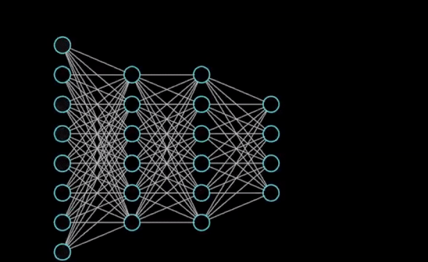
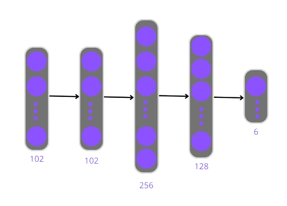

# HAR model Documentation


## Introduction

For the model, I need a technology that can work with my data (coordinates of the sensors of a smartphone) and can handle a large volume of these coordinates. Therefore, I chose neural networks as the principal candidate for the model because neural networks can work with diverse types of data. I also considered decision trees, but the splits in these trees are too difficult to define.

## Neural Network Modeling

To start the modeling of the NN, I generate 5 architectures with differents number of layers and different number of units per layer:

- Model 1: **5 Layers**
  - 1st Layer: 561 Units(ReLu)
  - 2nd Layer: 256 Units(ReLu)
  - 3rd Layer: 128 Units(ReLu)
  - 4th Layer: 64 Units(ReLu)
  - 5th Layer: 6 Units(Softmax)
 
- Model 2: **5 Layers**
  -  1st Layer: 102 Units(ReLu)
  -  2nd Layer: 128 Units(ReLu)
  -  3rd Layer: 64 Units(ReLu)
  -  4th Layer: 64 Units(ReLu)
  -  5th Lauer: 6 Units(Softmax)

 - Model 3: **4 Layers**
   -  1st Layer: 561 Units(ReLu)
   -  2nd Layer: 256 Units(ReLu)
   -  3rd Layer: 128 Units(ReLu)
   -  4th Layer: 6 Units(Softmax)

- Model 4: **5 Layers**
  - 1st Layer: 102 Units(ReLu)
  - 2nd Layer: 102 Units(ReLu)
  - 3rd Layer: 256 Units(ReLu)
  - 4th Layer: 128 Units(ReLu)
  - 5th Layer: 6 Units(Softmax)
 
- Model 5: **9 Layers**
  - 1st Layer: 561 Units(ReLu)
  - 2nd Layer: 1024 Units(ReLu)
  - 3rd Layer: 512 Units(ReLu)
  - 4th Layer: 256 Units(ReLu)
  - 5th Layer: 128 Units(ReLu)
  - 6th Layer: 64 Units(ReLu)
  - 7th Layer: 32 Units(ReLu)
  - 8th Layer: 24 Units(ReLu)
  - 9th Layer: 6 Units(Softmax)


I only explain the architecture that i choose, it's the 4th architecture:

<p align="center">
    
  </a>
</p>

I use 5 dense layers; the hidden layers have ReLU activation functions, and the output layer has Softmax activation. <br>
ReLU is the most common activation function in the hidden layers because its performance, compared to other functions, is either the same or better, but with faster computation times. On the other hand, for the output layer, the softmax activation function is the better option because I have a multiple classification problem. For more details, please refer to the 'Mathematics Details' section later. <br>
The loss function is categorical crossentropy because it is suitable for the activation of the output layer (Softmax). The optimizer I use is the Adam optimization. <br>
In the training state, I use 100 epochs with a batch size of 1000 and split 20% of the data for validation. <br>
For data preprocessing, in the notebook about AI development, you only find the one-hot encoding of the y_train and y_test datasets; all other transformations are detailed in the exploration notebook.<br>
The results shown bellow:
```
93/93 [==============================] - 1s 15ms/step - loss: 0.2297 - accuracy: 0.9443
Pérdida en el conjunto de prueba: 0.2297133505344391
Precisión en el conjunto de prueba: 0.9443312883377075
Model: "sequential_8"
_________________________________________________________________
 Layer (type)                Output Shape              Param #   
=================================================================
 dense_42 (Dense)            (None, 102)               57324     
                                                                 
 dense_43 (Dense)            (None, 102)               10506     
                                                                 
 dense_44 (Dense)            (None, 256)               26368     
                                                                 
 dense_45 (Dense)            (None, 128)               32896     
                                                                 
 dense_46 (Dense)            (None, 6)                 774       
                                                                 
=================================================================
Total params: 127868 (499.48 KB)
Trainable params: 127868 (499.48 KB)
Non-trainable params: 0 (0.00 Byte)
_________________________________________________________________
None
```

> To choose the units for the first layer, I employed a PCA (Principal Components Analysis) algorithm with the condition of capturing more than 95% of information. The result was 102 principal components (PCs). Although this is a method for data compression, my intuition suggested that using the number of PCs in the input layer would yield the same performance with greater efficiency. Maybe in other repositorie I explain this with more scientific rigor.


## Mathematic Details

I show you the mathematics details from each part of the Neural Network, enjoy it!

### Activations Functions

**ReLu:**<br>
The Rectified Linear Unit (ReLU) is a commonly used activation function in neural networks and is defined as:

$$f(x) = max(0, x)$$

where:
- $f(x)$ is the output of the ReLU activation function.
- $x$ is the input to the function.

In other words, the ReLU function outputs the input directly if it is positive, and zero otherwise.

<p align="center">
    Graphic Representation
</p>

<p align="center">
    
  </a>
</p>

**Softmax:**<br>
The Softmax activation function is commonly used in the output layer of a neural network for multi-class classification problems. It converts a vector of real numbers into a probability distribution.

Given an input vector \( z \) of length \( K \) (where \( K \) is the number of classes), the Softmax function is defined as:


<p align="center">
    
  </a>
</p>

where:
- ${Softmax}(z_i)$ is the $i$-th element of the Softmax output.
- $e$ is the base of the natural logarithm.
- $z_i$ is the $i$-th element of the input vector $z$.
- The denominator is the sum of the exponentials of all elements in the input vector $z$.

In essence, the Softmax function normalizes the input vector into a probability distribution over multiple classes.

<p align="center">
    Graphic Representation
</p>

<p align="center">
    
  </a>
</p>

In a neural network's output layer for a multi-class classification task, the Softmax function is often combined with the cross-entropy loss to train the model effectively.

### Loss Function:

The categorical cross-entropy loss function is commonly used in neural networks for multi-class classification problems. It measures the dissimilarity between the true distribution (ground truth) and the predicted probability distribution.
<br>
Given:
-  $y$: True distribution (one-hot encoded labels),
- $hat{y}$: Predicted probability distribution,

the categorical cross-entropy loss $L_{\text{CCE}}$ is defined as:

$$ L_{\text{CCE}}(y, \hat{y}) = - \sum_{i} y_i \cdot \log(\hat{y}_i) $$

where:
- $i$ ranges over all classes.
- $y_i$ is the $i$-th element of the true distribution (1 for the true class, 0 otherwise).
- $\hat{y}_i$ is the $i$-th element of the predicted probability distribution.

The negative logarithm is used to penalize confidently incorrect predictions more heavily. <br>
In neural network training, the goal is to minimize the categorical cross-entropy loss. This is often done using optimization algorithms like stochastic gradient descent (SGD) or its variants.

### Optimización Adam (Adaptive Moment Estimation)

<p align="center">
    Graphic Representation
</p>

<p align="center">
    
  </a>
</p>

> This is an illustrative example of how the different optimizer algorithms work.

Adam is a popular optimization algorithm used in training neural networks. It combines concepts from stochastic gradient descent (SGD) and RMSprop, adapting learning rates for each parameter individually.
<br>

Parameter updates in Adam are calculated using the following formulas:

#### First-Order Moment (Exponential Moving Average of Gradients)

$$ m_t = \beta_1 \cdot m_{t-1} + (1 - \beta_1) \cdot g_t $$

where:
- $m_t$ is the exponential moving average of gradients at time $ t $.
- $\beta_1$ is the exponential decay factor for the first moment (typically close to 1, e.g., 0.9).

#### Second-Order Moment (Exponential Moving Average of Squared Gradients)

$$ v_t = \beta_2 \cdot v_{t-1} + (1 - \beta_2) \cdot g_t^2 $$

where:
- $v_t$ is the exponential moving average of squared gradients at time $t$.
- $\beta_2$ is the exponential decay factor for the second moment (typically close to 1, e.g., 0.999).

#### Bias Correction

Since $m_t$ and $v_t$ are initialized to zero in the early steps, a bias correction is performed:

$$ \hat{m}_t = \frac{m_t}{1 - \beta_1^t} $$

$$ \hat{v}_t = \frac{v_t}{1 - \beta_2^t} $$

#### Parameter Update

Finally, the parameters are updated using the following formula:

$$ \theta_{t+1} = \theta_t - \frac{\alpha}{\sqrt{\hat{v}_t} + \epsilon} \cdot \hat{m}_t $$

where:
- $\theta_t$ are the parameters at time $t$.
- $\alpha$ is the learning rate.
- $\epsilon$ is a small constant to prevent division by zero (e.g., $1 \times 10^{-8}$).

### In summary:

In this neural network, hidden layers are composed of ReLU activation functions, and the output layer utilizes softmax, as it is a multiple classification problem. The chosen cost function is categorical_crossentropy, and for the optimization process, I selected the Adam optimizer algorithm.
