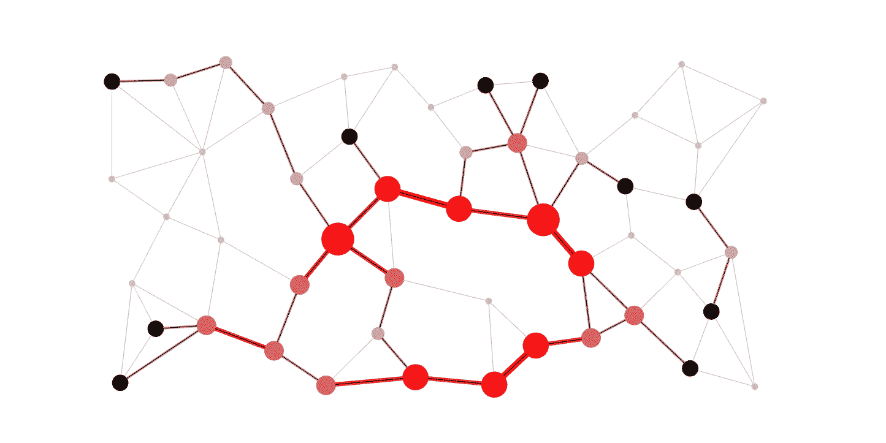

# HAR model Documentation

## Introduction

For the model, I need a technology that can work with my data (coordinates of the sensors of a smartphone) and can handle a large volume of these coordinates. Therefore, I chose neural networks as the principal candidate for the model because neural networks can work with diverse types of data. I also considered decision trees, but the splits in these trees are too difficult to define.

## Neural Network Modeling

To start the modeling of the NN, I generate 5 architectures with differents number of layers and different number of units per layer:

- Model 1: **5 Layers**
  - 1st Layer: 561 Units(ReLu)
  - 2nd Layer: 256 Units(ReLu)
  - 3rd Layer: 128 Units(ReLu)
  - 4th Layer: 64 Units(ReLu)
  - 5th Layer: 6 Units(Softmax)
 
- Model 2: **5 Layers**
  -  1st Layer: 102 Units(ReLu)
  -  2nd Layer: 128 Units(ReLu)
  -  3rd Layer: 64 Units(ReLu)
  -  4th Layer: 64 Units(ReLu)
  -  5th Lauer: 6 Units(Softmax)

 - Model 3: **4 Layers**
   -  1st Layer: 561 Units(ReLu)
   -  2nd Layer: 256 Units(ReLu)
   -  3rd Layer: 128 Units(ReLu)
   -  4th Layer: 6 Units(Softmax)

- Model 4: **5 Layers**
  - 1st Layer: 102 Units(ReLu)
  - 2nd Layer: 102 Units(ReLu)
  - 3rd Layer: 256 Units(ReLu)
  - 4th Layer: 128 Units(ReLu)
  - 5th Layer: 6 Units(Softmax)
 
- Model 5: **9 Layers**
  - 1st Layer: 561 Units(ReLu)
  - 2nd Layer: 1024 Units(ReLu)
  - 3rd Layer: 512 Units(ReLu)
  - 4th Layer: 256 Units(ReLu)
  - 5th Layer: 128 Units(ReLu)
  - 6th Layer: 64 Units(ReLu)
  - 7th Layer: 32 Units(ReLu)
  - 8th Layer: 24 Units(ReLu)
  - 9th Layer: 6 Units(Softmax)

I only explain the architecture that i choose, it's the 4th architecture

